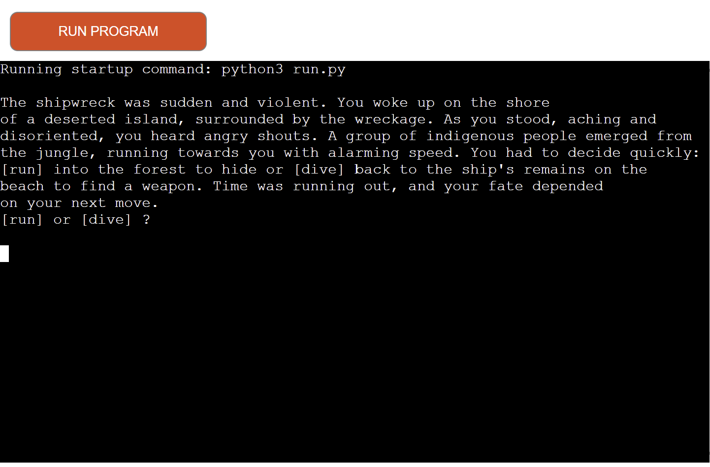

Purpose
The Island Adventure Game is a simple text-based choose your own adventure game. 
At the start and throughout the entire game, you make decisions that determine whether you win or lose. It’s all up to you! Can you make the right choices?

Screenshot:

Live link: 
https://kotkovets-dev-55193b94e73b.herokuapp.com/

### User Stories

As a user looking to play the game I want:
- the game to be simple and understandable
- the instructions to be clear
- the game to be engaging

As the owner of the site I want:
* users to be able to use the game easily and intuitively
* the game to be engaging
* errors to be handled efficiently

### Story map

Due to a lack of time, I ended up planning this project on a piece of paper. It is easier to me. But next time I will make it prettier and I will use Mind map on Miro.com website. 

[Story map](assets/readme-files/21.jpg) (Github will open a page)

### Technologies

Languages used:

Python 3

Frameworks, Libraries and Programs Used:

GitHub - for hosting the site

Heroku - for the deployment of the site

Gitpod - for editing the files

### Testing 

### Code Validation

[Python validator](https://pep8ci.herokuapp.com/) I fixed all errors while writing the code.
There were blank lines, whitespaces at the end of the lines and one wrong indentation. 

### Manual Testing

It is a simple adventure game so it took me short time to test all possible branches. Everything works correctly. 

### Deployment

### Publishing

The project was deployed using Heroku. The process is as follows:

First you need to sign up to Heroku.
On the next page there is a menu along the top. Navigate to 'Settings', where you will find the config vars. Scroll down to the section named 'Config vars' and click on the button labelled 'Reveal config vars'.

For the current iteration of this program, the singular config var needed is PORT 8000. Please enter the key as 'PORT' and the value as '8000', then hit 'Add'.

Just underneath 'Config vars' you should see 'Buildpacks'. Here you can add Python and Node.js scripts to the environment. Click on 'Add buildpack' and a menu with multiple buildpacks will open.

The order is very important. Please add Python first, by clicking on the Python button and then selecting 'Save changes'. Then go back into the 'Add buildpack' menu and select 'Node.js', and save your changes.

If you scroll back to the top of the page you will find the 'Deploy' tab, which has multiple options for deployment. I used Github for this project. When you click on the Github button a bar will come up for you to search for the repo you wish to connect to.

Once you have connected, you have the option to deploy automatically (the app will update every time you push) or manually (update only when you choose). I chose automatic and it works well.

### Acknowledgements

I want to say thank you to the entire team at Code Institute for this opportunity. It is really hard for me to learn all the material (especially JS). But you believe in me, and it inspires me. Thank you all!

